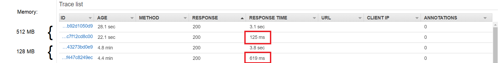

# Serving a Machine Learning Model with AWS Lambda

This guide explains how to serve a [sci-kit learn](https://scikit-learn.org/stable/) ML model via 
[AWS Lambda](https://aws.amazon.com/lambda/) and [Amazon API Gateway](https://aws.amazon.com/api-gateway/). Although the example is quite specific and the ML model simple, the method can easily be adopted for more complex models. The concept of building an AWS Lambda layer can also be extended to other python package dependencies.

<div align="center">
	
	<br>
    Application architecture with Amazon API Gateway and AWS Lambda.
    <br>
    <br>
</div>

In the completed setup a user is able to send HTTP requests to API Gateway triggering the execution of a Lambda function. This Lambda function will load the saved pre-trained model, load the dependencies from the right layer and make a prediction based on the input parameters provided by the user. The user receives the result as request response.

## Contents

- [0. Prerequisites](README.md#0-prerequisites)
- [1. Setting up an AWS Lambda layer](README.md#1-setting-up-an-aws-lambda-layer)
- [2. Training a simple ML model](README.md#2-training-a-simple-ml-model)
- [3. Setting up the Lambda function](README.md#3-setting-up-the-lambda-function)
- [4. Configuring API Gateway](README.md#4-configuring-api-gateway)
- [Appendix: Memory and Timeout settings](README.md#appendix-memory-and-timeout-settings)


## 0. Prerequisites

Not many things are needed in order to get started:

- An AWS Account
- A local installation of [Python](https://www.python.org/) and [pip](https://pip.pypa.io/en/stable/) (to download the python packages)

## 1. Setting up an AWS Lambda layer
Lambda layers are a way of providing your Lambda function with the dependencies it needs to execute. In our case that would be the `scikit-learn` package, which in turn depends on a bunch of other packages.
Luckily we have pip to figure out the dependency tree for us. The only thing we have to do is specify the right versions of the packages. There is a potential pitfall in this step (especially if you're working on a Windows machine) as you might think that you can simply reuse the packages already installed on your machine. However, AWS Lambda is running in a Linux environment, so the Python packages for Windows __won't work__! Instead we can ask pip to download the Linux versions of the dependencies we want by specifying `--platform manylinux1_x86_64`.  

```
pip download --python-version 38 --abi cp38 --platform manylinux1_x86_64 --only-binary=:all: --no-binary=:none: scikit-learn
```
Note: This example assumes our Lamda function is running on Pyton 3.8. If that is not the case simply adjust the `--python-version` and `--abi` arguments. Pip will download the packaged `.whl` files to the location you are currently at. By specifying `--only-binary=:all: --no-binary=:none:` we tell pip that we also want to download all the packages that the `sklearn` package depends on.

Now we're nearly ready to make a Lambda layer. The only things we have to do now is to unpack the `.whl` files and put them into the right folder structure. Unpacking is easy. We can do this on a Linux machine by calling `unzip path/to/file.whl` and on Windows by renaming `.whl` to `.zip` and simply extracting the files. Repeat this step for each package (in our case it should be `joblib`, `numpy`, `scikit_learn`, `scipy` and `threadpoolctl`). All folders called `*.dist-info` can safely be deleted. 

In order to make our Lambda function aware of the provided packages they have to be organized into a specific folder structure. The following diagram shows the structure and where to place all the extracted packages:

```
python/
└── lib/ 
    └── python3.8/
        └── site-packages/
            ├── joblib/  
            ├── numpy/
            ├── numpy.libs/
            ├── scikit_learn.libs/
            ├── scipy/
            ├── scipy.libs/
            ├── sklearn/
            └── threadpoolctl.py                    
```
Note: Again we are assuming that we are using Python 3.8. If you are using a different version adjust the folder name. Zip the whole folder structure before going on to the next step.

In the AWS Management Console search for "AWS Lambda". In the left-hand menu under "Additional resources" choose "Layers" and click "Create layer". Give the layer a name, upload the `.zip` file and choose a runtime (in our case Python 3.8). Note: For large files consider storing the `.zip` file in an S3 Bucket first and uploading it from there. Click "create".

<div align="center">
	
    <br>
</div>

Congrats! You successfully created a Lambda layer!

## 2. Training a simple ML model

Now to some Data Science. Before we can serve a ML model and do inference, we have to create and train it. This toy example will train a Random Forest classifier on the [Iris data set](https://en.wikipedia.org/wiki/Iris_flower_data_set) and save the pretrained model as a file.
To view the whole code go to [train.py](src/train.py).

First we import some dependencies and load the dataset from the pre-installed datasets in `sklearn`. 
```python
from sklearn import datasets
from sklearn.ensemble import RandomForestClassifier
from sklearn.model_selection import train_test_split
from sklearn.metrics import accuracy_score
from joblib import dump

# Import the Iris dataset
iris = datasets.load_iris()
```
We split the data into training and testing sets ...
```python
# Split into data and target vector
X = iris['data']
y = iris['target']

# Split into train and test data sets
X_train, X_test, y_train, y_test = train_test_split(X, y, test_size=0.33, random_state=42)
```
... and train a Random Forest Classifier on the training set.
```python
# Make a Random Forest classifier and train it
rfc = RandomForestClassifier()
rfc = rfc.fit(X_train,y_train)
```
We can validate the models' performace by checking the testing accuracy:
```python
# Evaluate the testing accuracy
y_pred = rfc.predict(X_test)
print("Testing accuracy: ", accuracy_score(y_test,y_pred))
```
The output should be:
```
Testing accuracy:  0.98
```
In a last step we save the trained model as a `.joblib` file to preserve it and load it in our Lambda function.
```python
# Store the trained model as .joblib file
dump(rfc, './myLambdaFunction/model.joblib')
```

## 3. Setting up the Lambda function
Now we have nearly all pieces of the puzzle. The only thing missing is the Lambda function itself. In our case this will be another Python file containing a function following a special syntax. The so-called Lambda Handler. Each time the Lambda function is triggerd this function is executed and is provided input via the `event` variable.

```python
def lambda_handler(event, context):
    # Load the features from the event dict
    sepal_length = float(event['sl'])
    sepal_width = float(event['sw'])
    petal_length = float(event['pl'])
    petal_width = float(event['pw'])
    # Set class names
    target_names = ['setosa','versicolor','virginica']
    # Load the pre-trained model
    rfc = load('model.joblib')
    # Predict a class based on the input
    y = rfc.predict([[sepal_length, sepal_width, petal_length, petal_width]])[0]
    # Turn encoding into class string
    c = target_names[y]
    print(c)
    # Return result as JSON
    return {
        'statusCode': 200,
        'body': c
    }
```
You can view the whole function in [lambda_function.py](src/myLambdaFunction/lambda_function.py). Zip "lambda_function.py" and model.joblib" before going on to the next step.

In the AWS Management Console search for "AWS Lambda". In the left-hand menu choose "Functions" and click "Create function". Give the function a name and select a runtime.

<div align="center">
	
    <br>
</div>

Under "Function code" click the "Actions" drop-down and choose "Upload a .zip file". 

<div align="center">
	
    <br>
</div>

Upload the `.zip` file containing "lambda_function.py" and "model.joblib". 

You can test the function by creating a Test. Go to Test > Configure Events > Create new test event. Provide a test name and the following body:
```JSON
{
  "sl": 6.9,
  "sw": 3.1,
  "pl": 5.1,
  "pw": 2.3
}
```
The four input parameters correspond to the four features the model assumes as input (sepal-length, sepal-width, petal-length, petal-width).
If you run the test the execution result should read:
```JSON
Response:
{
  "statusCode": 200,
  "body": "virginica"
}
```

## 4. Configuring API Gateway

This is great!. Our Lambda function works and is __hosting a ML model__! However, it has no way to communicate with the outside world and is pretty useless. Thus, we need to define a trigger to activate the execution of the function and figure a way to input data. AWS offers offers an integrated API service called API Gateway. We can easily define an API Gateway trigger by clicking "Add trigger" in the lambda function designer and select API Gateway. 

<div align="center">
	
    <br>
</div>

Choose "REST API" as API type and "Open" as Security and click "Create".

<div align="center">
	
    <br>
</div>

Back in the terminal of your Lambda function click on the link of your newly created API in the "API-Gateway" section.
This will bring you directly to the configuration terminal for your API. 

### 4.1 POST Request
There are different ways to communicate with the REST API. POST and GET requests are two of the most common. To configure your API to accept POST requests click the "Actions" drop-down menu and choose "Create Method". In the created drop-down menu choose "POST".

<div align="center">
	
    <br>
</div>

In the following setup process choose your Lambda function in the field "Lambda Function". You can test the execution of the API and the Lambda function by clicking on "Test" in the main menu of the POST method and providing the same "Request Body" that we used already earier:

```JSON
{
  "sl": 6.9,
  "sw": 3.1,
  "pl": 5.1,
  "pw": 2.3
}
```

Once you deployed your API ("Actions"-drop-down > Deploy API) it is able to receive input via POST requests, trigger the Lambda function and send the result back as response message. You can validate the whole process by using e.g. [Postman](https://www.postman.com/downloads/) to interact with the API.

### 4.2 GET Request
In case you would rather input the data directly from your browser via the URL you can also configure your API to accept GET requests. Click the "Actions" drop-down menu and choose "Create Method". In the created drop-down menu choose "GET". Just like in the instructions for the POST method choose your Lambda function in the field "Lambda Function".

Open the "Method Request" field and provide the input variables in the "URL Query String Parameters" section. Tick the "Required" boxes.

<div align="center">
	
    <br>
</div>

Go back and open the "Integration Request" field. Under the "Mapping Templates" section add a new mapping template of type "application/json". And fill in the following template:
```JSON
{
    "sl":  "$input.params('sl')",
    "sw":  "$input.params('sw')",
    "pl":  "$input.params('pl')",
    "pw":  "$input.params('pw')"
}
```

<div align="center">
	
    <br>
</div>

Click "Save". You can test the API by clicking "Test" in the "Method Execution" window and provide the following as "Query Strings":
```
sl=6.9&sw=3.1&pl=5.1&pw=2.3
```
Deploy your API ("Actions"-drop-down > Deploy API). And open a new tab in your browser. Enter the following URL replacing `<YOUR_API_URL>`:
```
https://<YOUR_API_URL>/myLambdaFunction/?sl=6.9&sw=3.1&pl=5.1&pw=2.3
```
You should receive a response in the following form:
```
{"statusCode": 200, "body": "virginica"}
```

Good job! You did it! You deployed your own Machine Learning model in the cloud and managed to make it communicate with the world. The best part is: AWS is doing all the computing for you and will ensure that your model has a high availability and scales with your application!

## Appendix: Memory and Timeout settings

We haven't touched upon this topic before as AWS took care of it automatically and it wasn't a big issue. However, once you want to serve more complex, computationally heavy models, the CPU and timeout settings could become a bottleneck or even lead to a failure if not configured correctly. When we set up our Lambda function it was configured with the default parameters for CPU Memory (128 MB) and Timeout (3 seconds). This is good enough for our simple model and still guarantees a response in a reasonable amount of time. 
<div align="center">
	
    <br>
    The Memory and Timeout can be adjusted in the Basic settings of your lambda function. Keep in mind that more memory will enable a faster response but also increase your costs.
    <br>
    <br>
</div>

We can check response times of our lambda functions by enabling active tracing and viewing the trace logs in [AWS X-Ray](https://aws.amazon.com/xray/). In the "Monitoring tools" of your Lambda function click "Edit" and switch on "Active tracing" under "AWS X-Ray". In the "Monitoring" tab of your Lambda function you can now choose "View traces in X-Ray".

<div align="center">
	
    <br>
    We can see that providing our Lambda function with four times the available CPU memory leads to an over four times faster response. Note: Just ignore the traces with response time > 3 seconds, those are "cold starts". 
    <br>
    <br>
</div>
